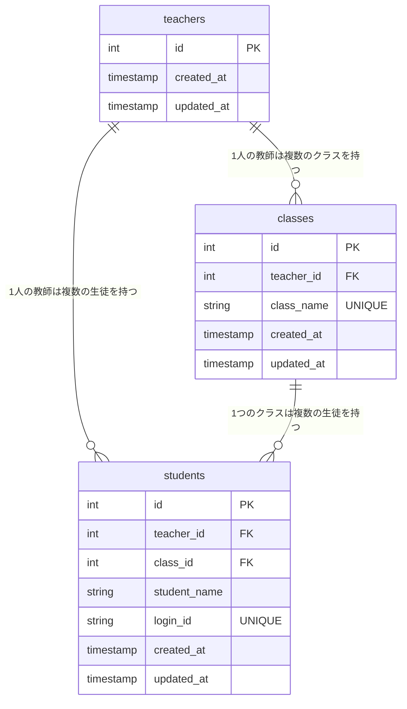

```mermaid
erDiagram
  teachers ||--o{ students : "1人の教師は複数の生徒を持つ"
  teachers ||--o{ classes: "1人の教師は複数のクラスを持つ"
  classes ||--o{ students: "1つのクラスは複数の生徒を持つ"

  teachers {
    int id "PK"
    timestamp created_at
    timestamp updated_at
  }

  classes {
    int id "PK"
    int teacher_id "FK"
    string class_name "UNIQUE"
    timestamp created_at
    timestamp updated_at
  }

  students {
    int id "PK"
    int teacher_id "FK"
    int class_id "FK"
    string student_name
    string login_id "UNIQUE"
    timestamp created_at
    timestamp updated_at
  }
```